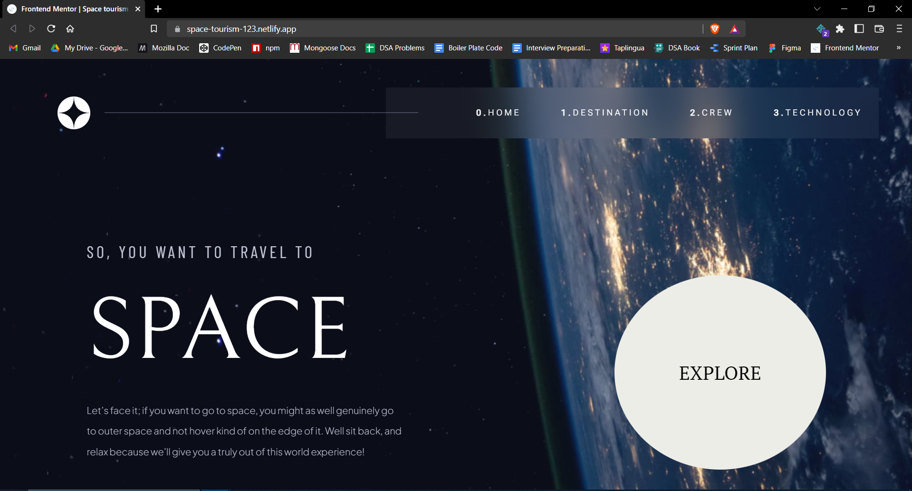
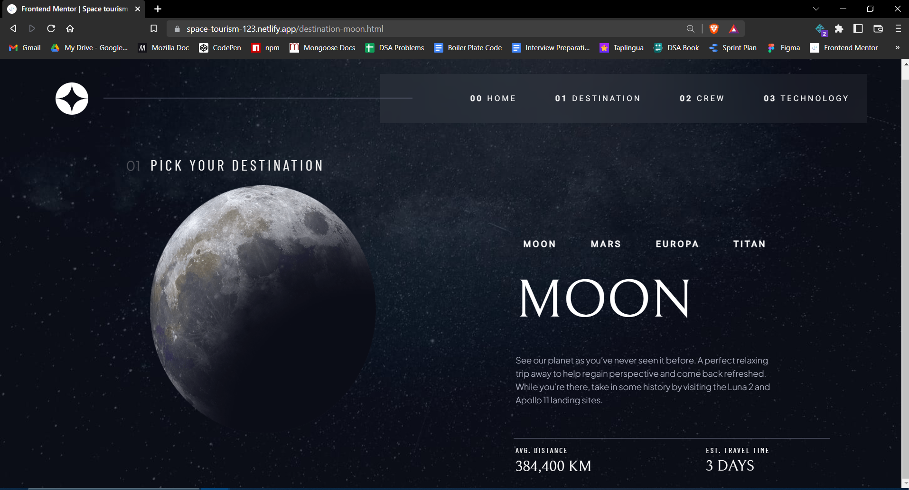
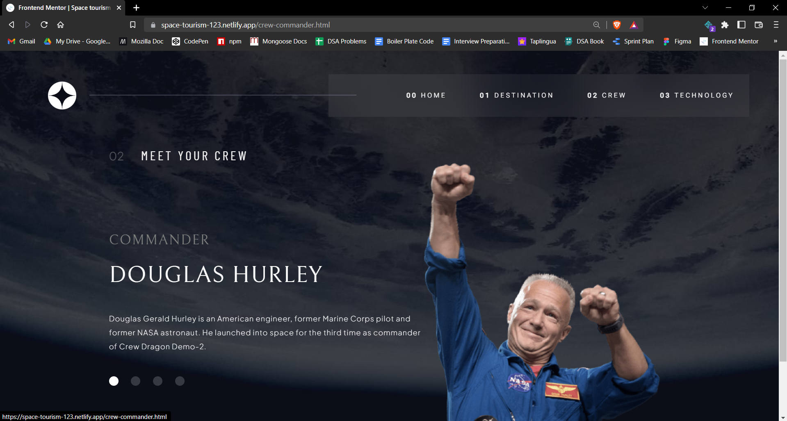
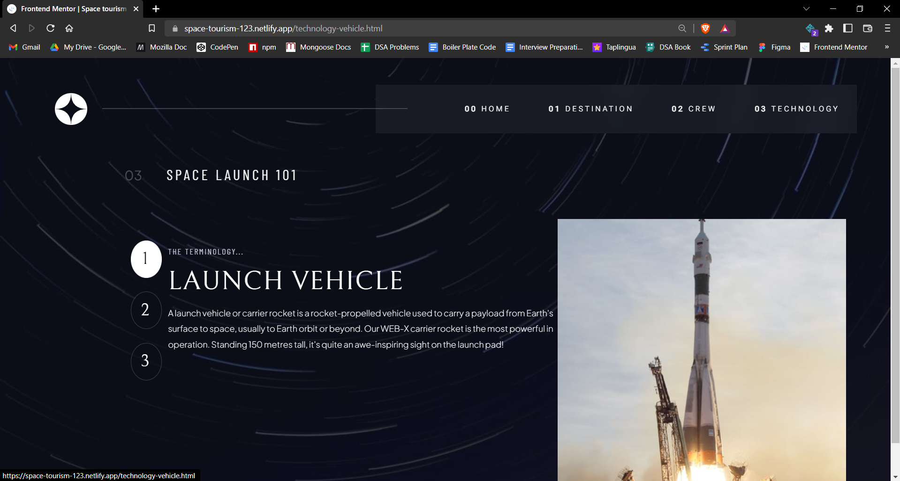

# Frontend Mentor - Space tourism website solution

This is a solution to the [Space tourism website challenge on Frontend Mentor](https://www.frontendmentor.io/challenges/space-tourism-multipage-website-gRWj1URZ3). Frontend Mentor challenges help you improve your coding skills by building realistic projects. 

## Table of contents

- [Overview](#overview-of-the-challenge)
  - [The challenge](#users-should-be-able-to)
  - [Links](#links)
  - [Screenshots](#screenshots)
- [My process](#my-process)
  - [Built with](#built-with)
  - [What I learned](#what-i-learned)
  - [Continued development](#continued-development)
  - [Useful resources](#useful-resources)
- [Author](#author)

**Note: Delete this note and update the table of contents based on what sections you keep.**

## Overview of the challenge

### Users should be able to:

- View the optimal layout for each of the website's pages depending on their device's screen size
- See hover states for all interactive elements on the page
- View each page and be able to toggle between the tabs to see new information

## Screenshots

### 1. Home Page

### 2. Destination Page

### 3. Crew Page

### 4. Technology Page

### Links

- Solution URL: [[Github Link](https://github.com/Hashal890/Space-tourism-website)]
- Live Site URL: [[Netlify Link](https://space-tourism-123.netlify.app/)]

## My process

### Built with

- Semantic HTML5 markup
- CSS custom properties
- Flexbox
- CSS Grid
- JS
- Desktop-first workflow

### What I learned

From this project I learnt about how to create a responsive webpage.

### Continued development

While creating webpage I'm facing issues about creating responsive webpage. So I will learn about bootstrap and tailwind css.

### Useful resources

- [Media Queries](https://developer.mozilla.org/en-US/docs/Web/CSS/Media_Queries/Using_media_queries) - This helped me for creating responsive webpage.

## Author

- LinkedIn - www.linkedin.com/in/HarshalPardeshi
- Frontend Mentor - [@Hashal890](https://www.frontendmentor.io/profile/Hashal890)
- Twitter - [@harshal258](https://twitter.com/harshal258)
